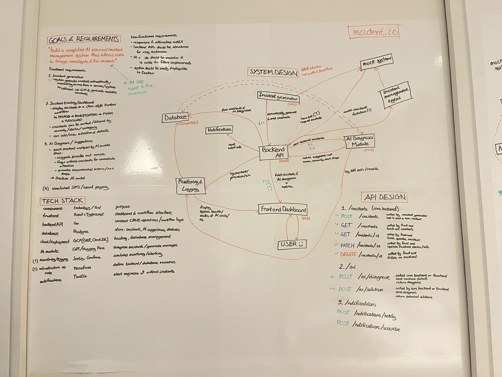
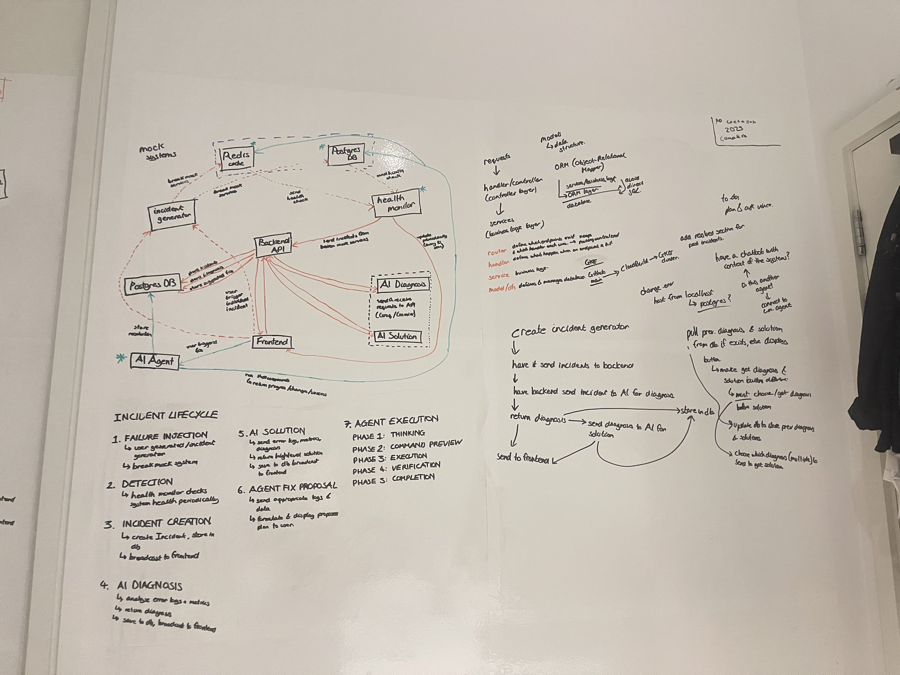

# Incident Management Simulator

A full-stack incident management simulation. Features include AI-powered diagnosis and remediation, failure injection into mock systems, and an autonomous AI SRE Agent that resolves issues.

## 🎥 Demo

<div align="center">
  
</div>


## 💡 How it started

Like most good projects, this one also started off with a big whiteboard and way too many arrows. Version 1 was a basic simulator with just AI-generated incidents and solutions. Version 2 took it further with mock systems running in containers, real failure injection, and an SRE Agent that actually attempts to fix things.

The final result turned out a bit different from the initial sketches - but who doesn't love a nice whiteboard diagram :)


<div align="center">
  <div style="display: inline-block; margin: 10px;">
    
    <p><strong>Version 1</strong></p>
  </div>
  <div style="display: inline-block; margin: 10px;">
    
    <p><strong>Version 2</strong></p>
  </div>
  <p><em>Early brainstorming & plans</em></p>
</div>

---

## Quick Start

### Prerequisites

**Required:**
- [Docker Desktop](https://www.docker.com/products/docker-desktop/) (must be running)

**Optional (for development):**
- [Node.js 18+](https://nodejs.org/) (for frontend development)
- [Go 1.21+](https://golang.org/dl/) (for backend development)
- [Python 3.9+](https://www.python.org/downloads/) (for AI services development)

### Local Development
```bash
# 1. Navigate to the project directory
cd incident-management-simulator

# 2. Copy environment file
cp .env.example .env

# 3. Add your API keys (at least one required)
# Edit .env and add: GROQ_API_KEY or GEMINI_API_KEY

# 4. Start everything (Docker will install all dependencies automatically)
./scripts/local-start.sh

# 5. Open http://localhost:3000
# Login with password: changeme
```

**Note:** Docker Compose will automatically:
- Pull all required images
- Install all dependencies (Node, Go, Python packages)
- Set up the database
- Start all services

No manual dependency installation needed!

### Getting API Keys

You need at least **one** AI provider API key:

**Option 1: Groq (Recommended - Free & Fast)**
1. Go to https://console.groq.com/keys
2. Sign up and create an API key
3. Add to `.env`: `GROQ_API_KEY=gsk_your_key_here`

**Option 2: Google Gemini (Free Alternative)**
1. Go to https://ai.google.dev/
2. Get an API key
3. Add to `.env`: `GEMINI_API_KEY=your_key_here`

### Deploy to Google Cloud (24/7 for ~$35-40/month)
```bash
# 1. Configure .env with API keys
cp .env.example .env
# Add: GROQ_API_KEY, GEMINI_API_KEY, VITE_APP_PASSWORD

# 2. Deploy (automatically configures for remote access)
./scripts/deploy-vm-standalone.sh

# 3. Access at https://YOUR_DOMAIN (e.g., https://incidentsimulator.net)
# Works from any device - frontend auto-configured for remote access
```

**Note:** 
- Uses e2-medium VM (~$35-40/month) for reliable performance
- API keys stored in GCP Secret Manager (encrypted, audited)
- Frontend automatically configured to use VM's public IP
- Firewall automatically configured for ports 3000, 8080, 8002
- No manual configuration needed for remote access

**Deployment is automated** - The script handles VM creation, Docker setup, SSL certificates, firewall configuration, and secret management.

---

## Features

- **Drag-and-drop incident board** (Triage → Investigating → Fixing → Resolved)
- **AI-powered diagnosis & solutions** (Groq/Gemini)
- **Failure injection** into mock systems (Redis, PostgreSQL, Disk)
- **System health monitoring** with real-time metrics
- **Live collaboration** with anonymous animal names
- **Light/Dark themes**
- **WebSocket real-time updates**
- **Full incident history & timeline**

---

## Commands

**Local Development:**
```bash
./scripts/local-start.sh      # Start all services
./scripts/local-stop.sh       # Stop all services
./scripts/local-logs.sh       # View logs
./scripts/local-restart.sh    # Restart services
```

**VM Deployment:**
```bash
./scripts/deploy-vm-standalone.sh   # Deploy to GCP VM
./scripts/update-vm-standalone.sh   # Update deployed app
./scripts/check-vm-status.sh        # Check VM & container status
./scripts/cleanup-vm-standalone.sh  # Delete all GCP resources
```

---

## Architecture

| Service | Port | Purpose |
|---------|------|---------|
| Frontend | 3000 | React UI |
| Backend | 8080 | Go API |
| AI Diagnosis | 8000 | AI analysis |
| Incident Generator | 8001 | Auto-generate incidents |
| Health Monitor | 8002 | System health checks |
| PostgreSQL | 5432 | Database |
| Redis (Mock) | 6379 | Test failure injection |
| PostgreSQL (Mock) | 5433 | Test failure injection |

---

## Authentication

**Default password:** `changeme`

**To change it**, add to your `.env` file:
```bash
VITE_APP_PASSWORD=your_secure_password
```

Then rebuild the frontend:
```bash
docker compose up --build -d frontend
```

---

## How to Use

1. **Generate Incidents** - Click "Generate Incident" for AI-created scenarios
2. **Inject Failures** - Click "Trigger Failure" → Select system to break
3. **Manage Incidents** - Drag cards between columns to update status
4. **View Details** - Click cards to see AI diagnosis, suggested fixes, and timeline
5. **Collaborate** - Open in multiple browsers to see live user tracking

---

## Tech Stack

**Frontend:** React, TypeScript, Tailwind CSS, Vite  
**Backend:** Go, Gin, GORM, WebSockets  
**AI:** Python, FastAPI, Groq/Gemini  
**Database:** PostgreSQL  
**Infrastructure:** Docker, Docker Compose, GCP

---

## Environment Variables

Required in `.env`:
```env
# At least one AI provider (Groq recommended)
GROQ_API_KEY=gsk_your_key_here
GEMINI_API_KEY=your_key_here  # Optional fallback

# Frontend password (optional, defaults to "changeme")
VITE_APP_PASSWORD=your_secure_password

# Database (auto-configured in Docker)
POSTGRES_HOST=postgres
POSTGRES_PORT=5432
POSTGRES_USER=incidentuser
POSTGRES_PASSWORD=incidentpass
POSTGRES_DB=incidentdb
```

---

## Troubleshooting

**Docker not running:**
```bash
# Make sure Docker Desktop is running
docker info

# If you see an error, start Docker Desktop
```

**Services won't start:**
```bash
./scripts/local-stop.sh && ./scripts/local-start.sh
```

**Check service status:**
```bash
docker compose ps
docker compose logs -f
```

**Reset everything:**
```bash
docker compose down -v
./scripts/local-start.sh
```

**Missing API keys:**
- Make sure you have at least one API key (Groq or Gemini) in your `.env` file
- Check the "Getting API Keys" section above

**Drag-and-drop not working:**
- Try hard refresh: `Ctrl+Shift+R` (Windows/Linux) or `Cmd+Shift+R` (Mac)
- Or test in incognito/private browsing window
- Browser may be caching old CORS settings

**Remote access not working:**
- Check firewall rules: `gcloud compute firewall-rules list`
- Verify containers are running: `./scripts/check-vm-status.sh`
- Test backend API: `curl https://YOUR_DOMAIN/api/v1/health`

---

## Documentation

- [Technical Report](./TECHNICAL_REPORT.md) - Complete architecture documentation (1831 lines)

---

## License

MIT
